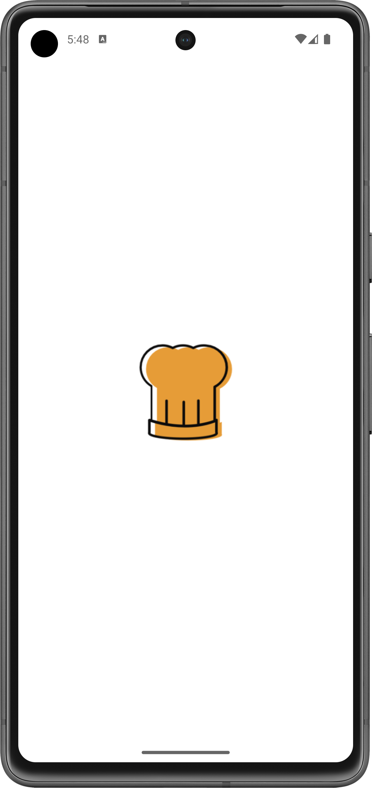
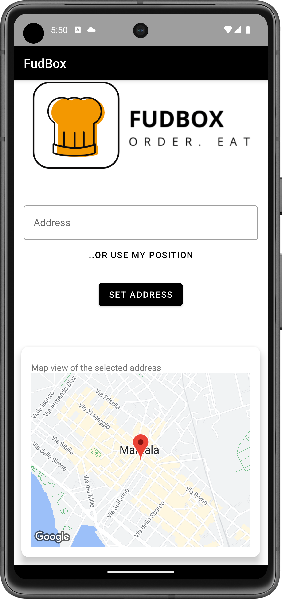
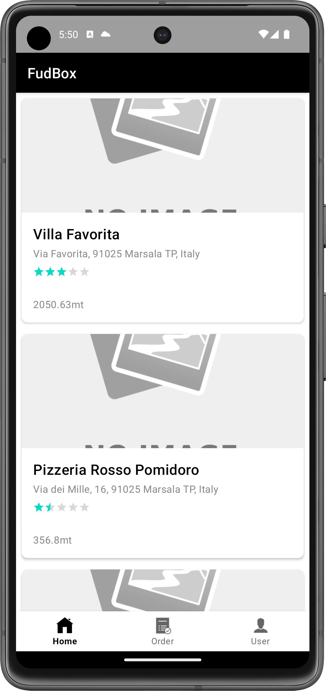
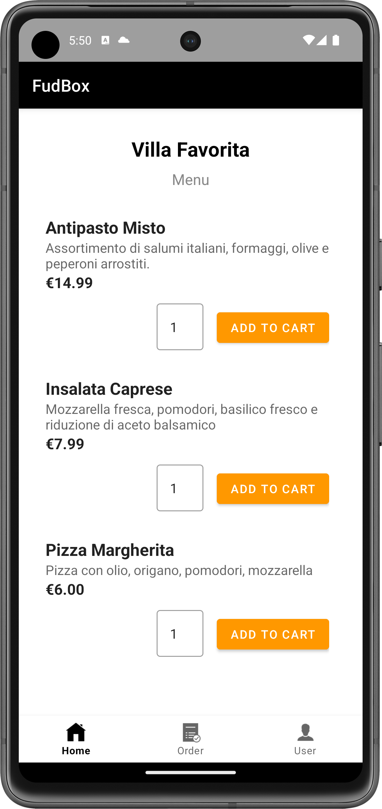
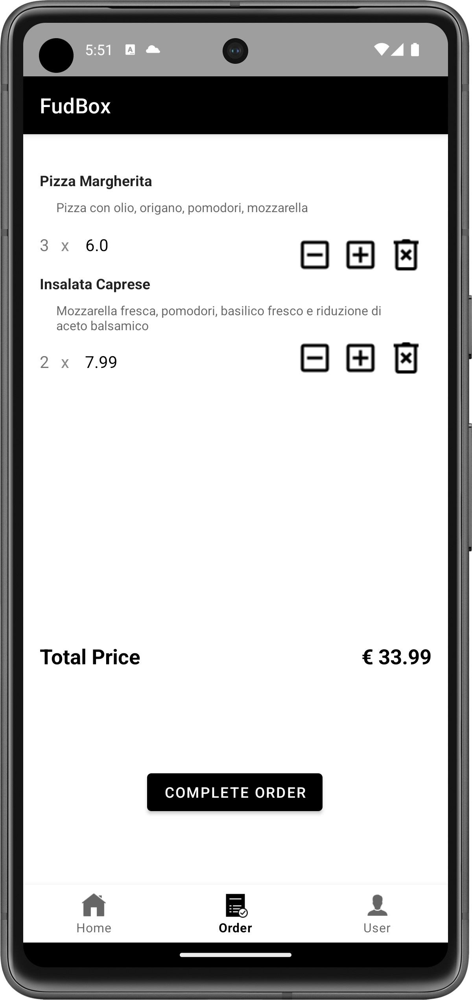
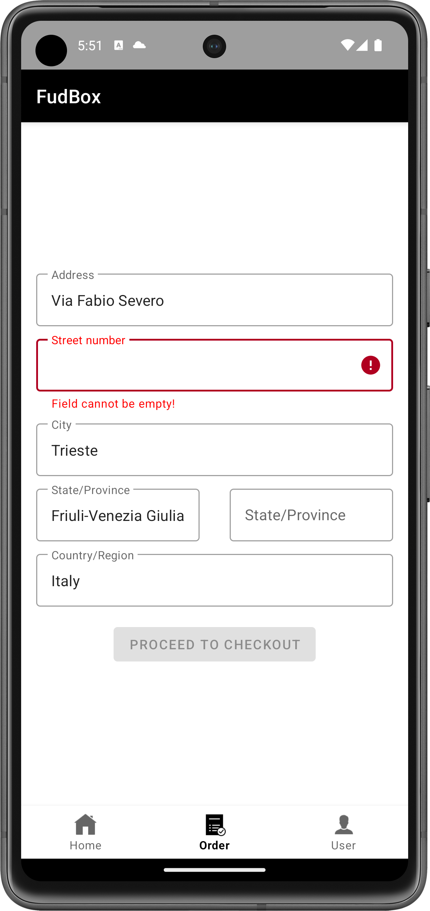
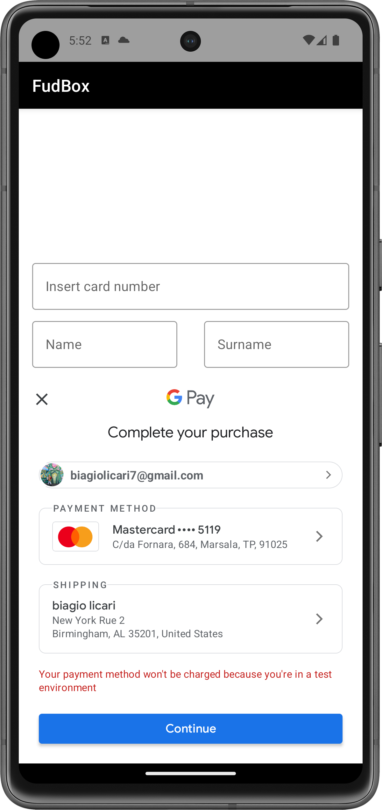
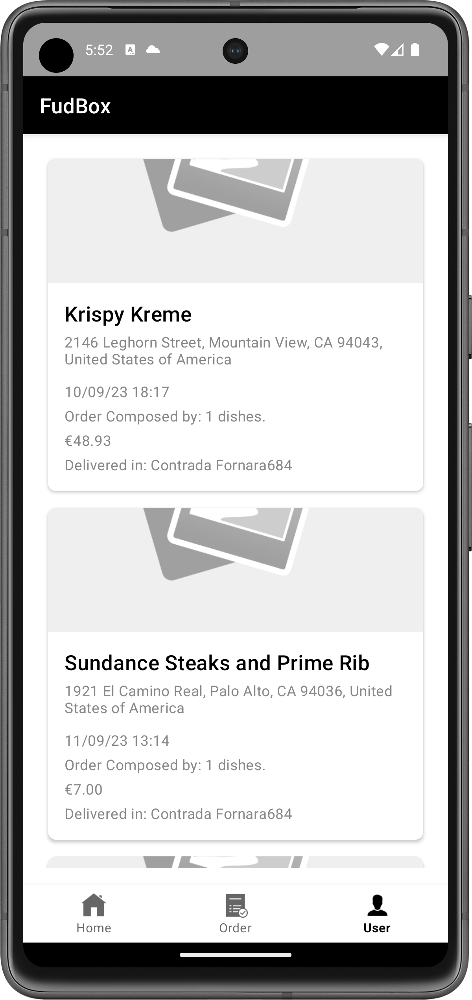

  

 
<i>A Food App for Android using Java 💕</a> & <a href="https://firebase.google.com/">Firebase 🔥</a>  </i>
  
  
## About the App 🥘

  - FudBox is a App to order food from restaurant near to us 🤤!
  
  - Login or SignUp using any account (P.S. Your credentials are safe thanks to Firebase Auth!) 🤩 .
  
  - You can also see your past orders 😎, you can also see the detail of each order completed 😍.

  -You can pay using your credit card o using Google Pay 😎😎
  
  - All the data is stored in Firebase 🔥. Because of real-time database you'll get the latest and yummy food 🍔.
  
  - You can use Geolocalization to search restaurantsa near to your location or can insert a place using GMaps autocomplete address🔥🔥
  
## Screens 😍

  

  

## How To 🤩

  - Clone the project

  - Import the project in Android Studio

  - Build Gradle and Run the project 😎😎

## Devices Used to Test 👀

  - Pixel 7 Pro API 33

  - Pixel 7 API 31

  
